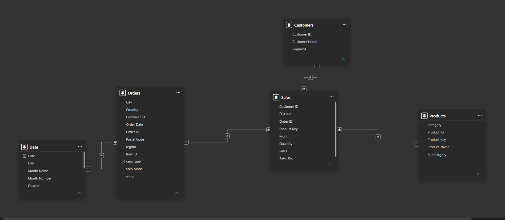
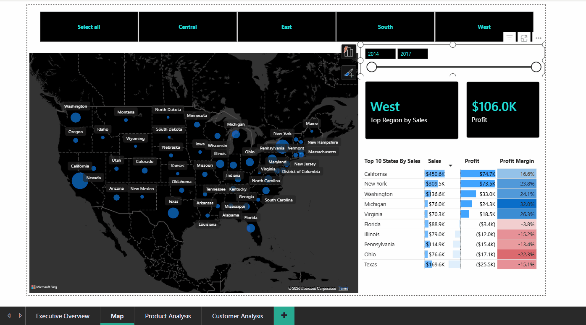

# Superstore Sales Analytics | SQL + Power BI

## Project Overview

This project analyzes retail sales data from the Superstore dataset using SQL and Power BI.

The objective was to transform raw transactional data into a business-ready analytical model, solve real-world data quality issues, uncover profitability drivers, and build an interactive dashboard to support business decision-making.

---

## Data Challenges & Solutions

### Challenge 1: Repeated Order-Product Records

During data exploration, 8 records combinations were found for the same Order ID and Product ID combination.

**Investigation Result**

These records contained different sales, profit, and quantity values, indicating valid split shipments rather than duplicate transactions.

**Solution**

All transaction records were preserved to maintain transaction-level accuracy and prevent business data loss.

---

### Challenge 2: Product ID Mapping Inconsistency

During data exploration, 30 product IDs were found to be associated with more than one distinct product name.

**Investigation Result**

Upon inspection, the mapped names were confirmed to be genuinely different products — for example, product ID FUR-CH-10001146 was associated with both "Global Task Chair, Black" and "Global Value Mid-Back Manager's Chair, Gray" — two entirely distinct items sharing one source ID. This was a keying deficiency in the source system, not a naming error. Raw data was left untouched as per data integrity principles.

**Solution**

A products dimension table was created with an auto-incremented surrogate key. Products were mapped by joining on both product_id and product_name as a composite key to sales table, ensuring each genuinely distinct product received its own stable identifier without modifying the raw source data.

---

### Challenge 3: Multiple IDs Assigned to the Same Product Name

During data exploration, 16 product names were found to be associated with more than one distinct product ID.

**Investigation Result**

Upon inspection, products sharing the same name were confirmed to be genuinely different items — for example, "Staples" appeared under 10 different product IDs (OFF-FA-10000735, OFF-FA-10001229, and others), each representing a distinct staple product variant sold under the same generic name. This reflected a source system limitation, not duplicate data. Raw data was left untouched as per data integrity principles.

**Solution**

A products dimension table was created with an auto-incremented surrogate key. By joining on both product_id and product_name as a composite key to sales table, each unique product combination was correctly treated as a distinct entry, resolving the identifier ambiguity without altering the original data.

---

### Challenge 4: Transactional Redundancy

The raw dataset contained repeated customer, product, and geographic information across transactions.

**Solution**

A Star Schema was designed to separate Customers, Products, Orders, and Sales into dedicated analytical tables.

---

### Challenge 5: Data Integrity Validation

Data quality needed to be verified after loading into the analytical model.

**Solution**

Validation queries were implemented to confirm:

* Successful dimension loading
* Successful fact table loading
* No null foreign keys
* Complete surrogate-key mapping

> Full investigation queries:
> [01_schema_exploration.sql](sql/01_schema_exploration.sql)

---

## Business Questions

### Profitability Analysis

* Which product categories generate the most profit?
* Which subcategories consistently lose money?
* Which products contribute most to overall losses?
* How do discounts impact profitability?

### Customer Analysis

* Which customer segments are most valuable?
* Who are the highest-profit customers?

### Geographic Analysis

* Which regions perform best and worst?
* Which regions generate high revenue but low profit?

### Performance Analysis

* How has the business performed over time?
* What are the month-over-month growth trends?
* What are the year-over-year growth trends?

### Product Analysis

* Which products drive category performance?
* What are the top-performing products within each category?

### Operational Analysis

* Which shipping modes are most used?
* Does shipping method influence profitability?

---

## Data Cleaning

Key cleaning and preparation activities:

* Investigated repeated order-product records
* Preserved valid split shipment transactions
* Standardized product mapping logic
* Removed analytical redundancy through normalization
* Performed post-load validation checks

> Full ETL process:
> [03_data_cleaning.sql](sql/03_data_cleaning.sql)
---

## Data Model

A Star Schema was designed to support scalable analytical reporting.

### Dimensions

* Customers
* Products
* Orders
* Date

### Fact Table

* Sales

### Modeling Concepts

* Star Schema Design
* Primary Keys
* Foreign Keys
* Surrogate Keys
* Fact & Dimension Modeling

### Star Schema

> Full schema design:
> [02_data_model_design.sql](sql/02_data_model_design.sql)
---

## SQL Analysis

The project includes analytical SQL queries covering:

### Business Performance

* Overall Sales
* Overall Profit
* Profit Margin

### Profitability Analysis

* Category Performance
* Loss-Making Subcategories
* Loss-Making Products
* Discount Impact Analysis

### Customer Analysis

* Customer Segment Analysis
* Top Customers by Profit

### Geographic Analysis

* Regional Profitability

### Time-Series Analysis

* Monthly Growth Analysis
* Yearly Growth Analysis

### Product Analysis

* Top Products Within Each Category

### Operational Analysis

* Ship Mode Analysis

### SQL Concepts Demonstrated

* Joins
* Aggregations
* CTEs
* Window Functions
* LAG()
* DENSE_RANK()
* PARTITION BY
* CASE Statements
* Data Validation Queries

> Full business analysis:
> [04_business_analysis.sql](sql/04_business_analysis.sql)
---

## Key Business Insights

* Discounts above 20% significantly reduce profitability.
* Tables and Bookcases are the largest loss-making subcategories.
* A small number of products account for a disproportionate share of total losses.
* Profitability varies considerably across regions.
* A small group of customers contributes a large share of overall profit.
* Sales growth does not always translate into profit growth.
* A few products drive the majority of category revenue.

---

## Power BI Dashboard

The SQL star schema was connected to Power BI to build an
interactive dashboard for analyzing sales, profitability,
customers, products, and regional performance.

---

### Dashboard Walkthrough

*Full dashboard walkthrough showing interactive slicers,
dynamic KPI cards, and cross-page navigation.*

---

### Cross-Page Filtering

*Region selection on Overview page automatically filters
all visuals across every dashboard page simultaneously.*

---

*Full dashboard walkthrough showing all 4 pages images,
interactive slicers and dynamic KPI cards.*

### Dashboard Pages

| Page | Description |
|------|-------------|
| Executive Overview | Company-wide KPIs and performance summary |
| Product Analysis | Category and subcategory profitability |
| Customer Analysis | Customer segments and top customer insights |
| Geographic Analysis | Regional and state-level performance |

### Dashboard Features

- Interactive slicers with cross-page sync
- Dynamic KPI cards with month-over-month comparison
- Discount impact analysis
- Year-over-Year and Month-over-Month trends
- Drill-down from region to state to city
- Dynamic insight generation via DAX

---

## DAX Measures

Advanced DAX measures are documented separately:

📄 [DAX Measures](powerbi/dax_measures.md)

Highlighted measures include:

* Profit Margin
* Average Order Value
* Previous Month Sales
* Top Region by Sales
* Worst Subcategories
* Dynamic Insight Measure

---

## Business Recommendations

1. Limit excessive discounting to protect profitability.
2. Reassess pricing strategy for Tables and Bookcases.
3. Review loss-making products for potential repricing or discontinuation.
4. Focus retention efforts on high-profit customers.
5. Investigate low-margin regions to improve profitability.
6. Expand sales of high-performing products and categories.

---

## Tech Stack

### Data Processing

* MySQL 8

### Data Modeling

* Star Schema
* Fact-Dimension Modeling

### Visualization

* Power BI
* DAX
* Power Query

### Analysis

* SQL
* Window Functions
* Business Intelligence
* Data Analytics

---
